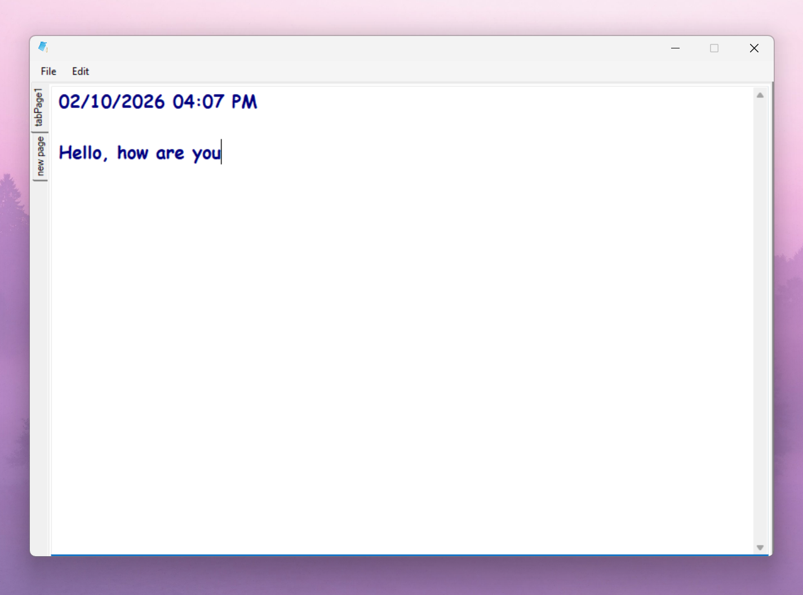

# C# WinForms Notepad 🗒️

A simple Notepad application built with C# and Windows Forms as a learning project.

This project was created while learning Windows Forms and practicing working with controls, events, dialogs, file handling, and basic code organization.

## Features

* Create multiple tabs
* Open and save text files
* Save As
* Insert current date and time at the cursor position
* Copy, Cut, Paste
* Select All
* Clear selected text
* Change font and text color
* Convert selected text to uppercase/lowercase
* Context menu

## Technologies

* C#
* .NET
* Windows Forms
* Visual Studio

---
## 📸 Preview

